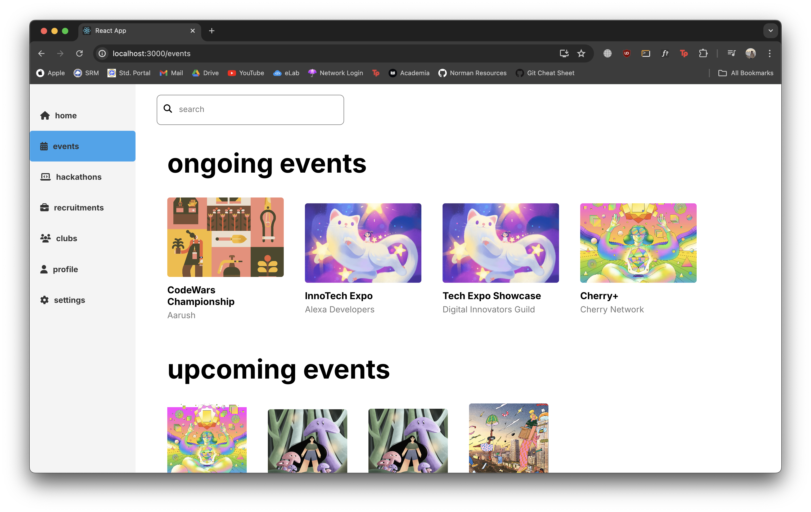
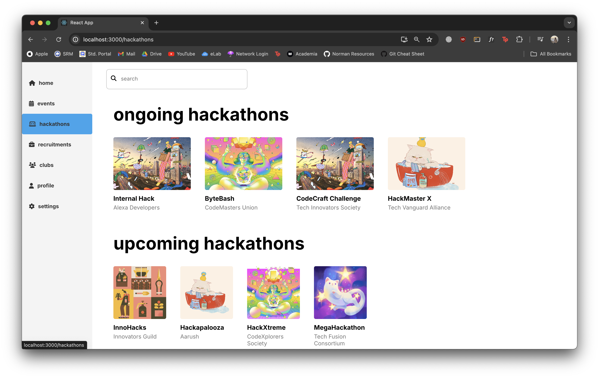
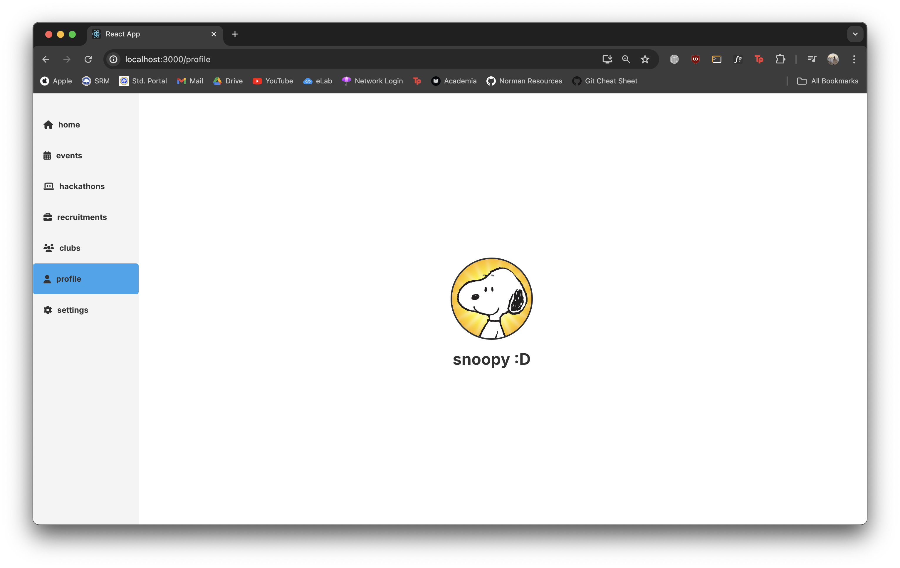

# evinco

welcome to **evinco**, which stands for **event-interact-connect**! a platform designed to streamline the organization and participation in tech events, hackathons, recruitments, and more. explore the features and their technical implementations that make evinco a powerful tool for tech enthusiasts!

---

## features :D

### 1. events


stay updated with the latest tech events. Our events feature allows you to:
- **browse events:** explore detailed descriptions, schedules, and venues.
- **register:** quick and easy registration process.
- **reminders:** get notifications for events you're interested in.

**implementation:**
- **frontend:** HTML, CSS, and JavaScript along with React for a dynamic UI.
- **backend:** Node.js and Express for handling API requests.
- **database:** MongoDB for storing event details and user registrations.

### 2. recruitments


find and apply for tech job opportunities. Our recruitment feature includes:
- **job listings:** view and apply for jobs from top companies.
- **application tracker:** track your job applications.

**implementation:**
- **frontend:** HTML, CSS, and JavaScript along with React for a dynamic UI.
- **backend:** Node.js and Express for handling API requests.
- **database:** MongoDB for storing recruitment details and user registrations.

### 3. hackathons


participate in exciting hackathons. Features include:
- **hackathon listings:** find hackathons from various domains.
- **submission portal:** submit your projects and track progress.

**implementation:**
- **frontend:** HTML, CSS, and JavaScript along with React for a dynamic UI.
- **backend:** Node.js and Express for handling API requests.
- **database:** MongoDB for storing hackathon details and user registrations.

### 4. profile


manage your personal and professional information. Features include:
- **personal info:** update contact details and social media links.
- **professional info:** add your skills, experiences, and projects.
- **achievements:** showcase your accomplishments and badges.

**implementation:**
- **frontend:** HTML, CSS, and JavaScript along with React for a dynamic UI.
- **backend:** Node.js and Express for handling API requests.
- **database:** MongoDB for storing profile details.

---

## getting started... now we're talking!

follow these steps to set up evinco locally:

1. **clone the repository:**
   ```bash
   git clone https://github.com/nikunjmathur08/evinco.git
   cd evinco
   ```

2. **install dependencies:**
   ```bash
   npm install
   ```

3. **set up the database:**
   ```bash
   # For MongoDB
   mongod --dbpath /path/to/your/db
   ```

4. **run the development server:**
   ```bash
   npm start
   ```

5. **navigate to the application:**
   open your browser and go to `http://localhost:3000`

---

## contributing... most welcome!!

we welcome contributions from the community! To contribute:

1. fork the repository.
2. create a new branch for your feature or bug fix.
3. make your changes and commit them with a detailed message.
4. push your changes to your forked repository.
5. create a pull request to the main repository.

---

## license

this project is licensed under the MIT License - see the [LICENSE](LICENSE) file for details.

---

## acknowledgments

- special thanks to @SumatiPaliwal89 who have made this project possible.
- thanks to the open-source community for providing invaluable resources and tools.

---

enjoy exploring **evinco** and happy coding! If you have any questions or need further assistance, feel free to reach out.

---